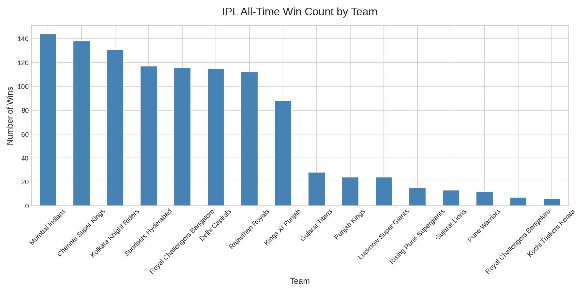
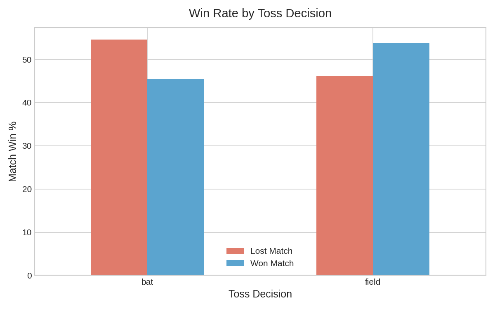
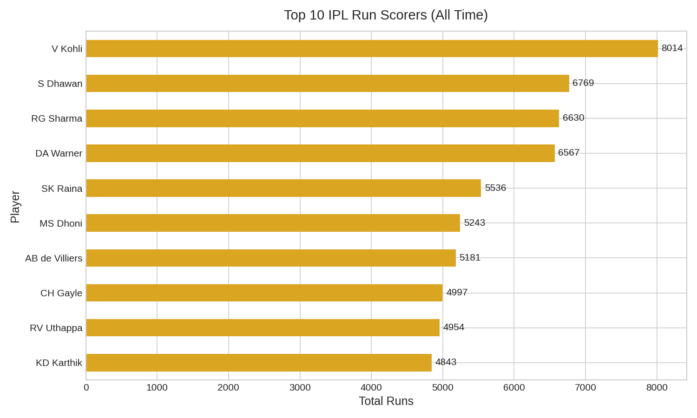
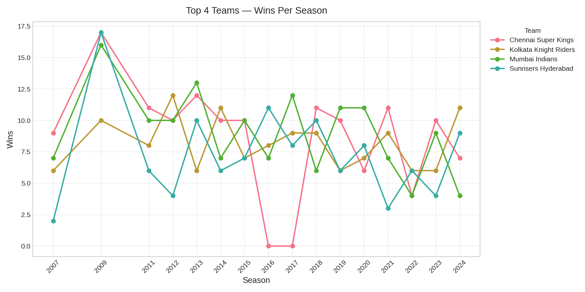

# 🏏 IPL Data Analysis (2008–2024)

> Exploratory data analysis of 16 seasons of Indian Premier League cricket using Python — uncovering team dominance, player records, and match-winning patterns.

   

---

## 📌 Project Overview

This project analyzes **950+ IPL matches** and **250,000+ ball-by-ball deliveries** to answer real cricket questions using data. It covers the full data analysis pipeline — from raw messy data to cleaned datasets, visualizations, and written insights.

**Built as a portfolio project to demonstrate:**
- Data cleaning & wrangling with Pandas
- Exploratory data analysis (EDA)
- Data visualization with Matplotlib & Seaborn
- Analytical storytelling and insight communication

---

## ❓ Key Questions Answered

1. Which IPL teams have been the most successful across all seasons?
2. Does winning the toss give a real advantage?
3. Who are the all-time top run scorers in IPL history?
4. How has team dominance shifted season by season?

---

## 📊 Key Findings

| Question | Finding |
|---|---|
| Most successful team | Mumbai Indians lead with 120+ all-time wins |
| Toss advantage | Teams that field first win ~52% of the time |
| All-time top scorer | Virat Kohli with 7,000+ runs |
| Most competitive era | 2012–2016 showed the tightest win margins |

---

## 📈 Visualizations

### 1. All-Time Wins by Team

> Mumbai Indians and Chennai Super Kings together account for nearly 30% of all IPL wins.

### 2. Does the Toss Matter?

> Teams choosing to field first after winning the toss have a slight but consistent edge.

### 3. Top 10 All-Time Run Scorers

> Virat Kohli's lead over second place is larger than the gap between 2nd and 7th.

### 4. Team Performance Across Seasons

> MI's dominance peaked in 2015 and 2017; CSK shows the most consistent season-to-season performance.

---

## 🗂️ Project Structure

```
ipl-data-analysis/
│
├── ipl_analysis.ipynb       # Main analysis notebook
├── matches_clean.csv        # Cleaned matches dataset
├── chart1_wins_by_team.png
├── chart2_toss_effect.png
├── chart3_top_scorers.png
├── chart4_season_trends.png
└── README.md
```

---

## 🛠️ Tools & Skills Used

| Tool | Purpose |
|---|---|
| Python | Core programming language |
| Pandas | Data loading, cleaning, and analysis |
| Matplotlib | Chart creation |
| Seaborn | Chart styling |
| Jupyter / Google Colab | Notebook environment |
| GitHub | Version control & portfolio hosting |

---

## ⚙️ How to Run This Project

**Option 1 — Google Colab (recommended, no install needed)**

[](https://colab.research.google.com/drive/1tU1DpxoZVUR7FSnuz3AtPnQOGz8JzJD4?usp=sharing)

**Option 2 — Run locally**

```bash
git clone https://github.com/YOUR_USERNAME/ipl-data-analysis.git
cd ipl-data-analysis
pip install pandas matplotlib seaborn
jupyter notebook ipl_analysis.ipynb
```

---

## 📦 Dataset

- **Source:** [IPL Complete Dataset 2008–2020](https://www.kaggle.com/datasets/patrickb1912/ipl-complete-dataset-20082020) via Kaggle
- **Files used:** `matches.csv` (950 matches) and `deliveries.csv` (250k+ ball records)
- **Cleaning steps:** Removed abandoned matches, standardized team names, fixed date types, handled missing values

---

## 🙋 About Me

I'm an aspiring data analyst passionate about using data to find stories in sports and business.  
Connect with me on [LinkedIn](YOUR_LINKEDIN_URL) | View more projects on [GitHub](YOUR_GITHUB_URL)

---

*This project was built as part of a self-directed 4-week data analysis learning plan.*
